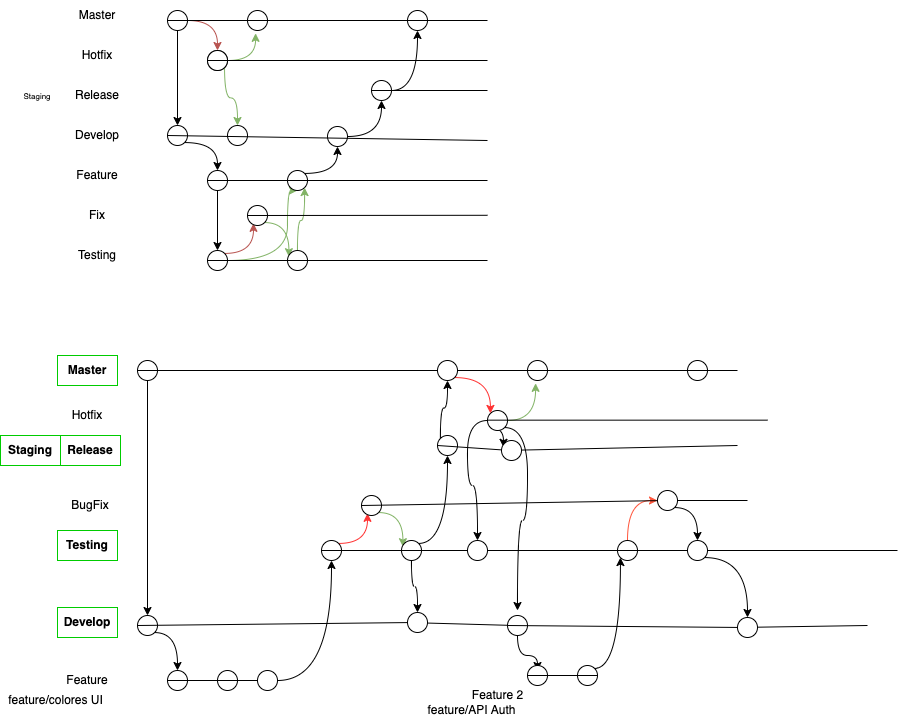

## Diagrama GitFlow

## 2.a Creación de ambientes para microservicios

Se utilizaron los microservicios propuestos por el Docente. Los cuatro microservicios fueron subidos a repositorios independientes y con sus correspondientes ramas: `main`, `Develop`, `Testing` y `Staging`.

Esto fue siguiendo una metodología de trabajo basada en Gitflow según se muestra en el diagrama a continuación.

